# 🛡️ SOC-Nemotron-CLI-Windows

[](LICENSE)
[](PLATFORM_SUPPORT.md)
[](https://opencode.ai)
[](https://build.nvidia.com/explore/discover)
[](https://www.microsoft.com/windows)

---

<p align="center">
  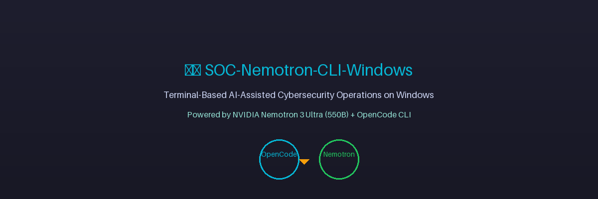
</p>

<p align="center">
  <strong>Terminal-Based AI-Assisted Cybersecurity Operations on Windows</strong><br />
  Powered by <strong>NVIDIA Nemotron 3 Ultra (550B)</strong> + <strong>OpenCode CLI</strong>
</p>

<p align="center">
  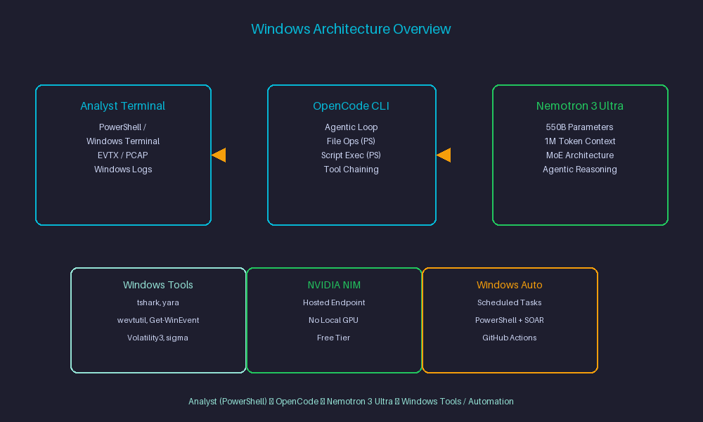
</p>

---

## 📑 Table of Contents

- [Quick Start (5 min)](#-quick-start-5-min)
- [About This Project](#-about-this-project)
- [Why This Stack on Windows](#-why-this-stack-on-windows)
- [Platform Support](#-platform-support)
- [Repository Structure](#-repository-structure)
- [Skill-Level Operational Mapping](#-skill-level-operational-mapping)
- [Setup & Authentication (Windows)](#-setup--authentication-windows)
- [Verify Your Installation](#-verify-your-installation)
- [Prompt Templates (Copy → Edit → Run)](#-prompt-templates-copy--edit--run)
- [Common Mistakes & Fixes (Windows)](#-common-mistakes--fixes-windows)
- [Learning Path (Week-by-Week)](#-learning-path-week-by-week)
- [Example Prompts by Use Case](#-example-prompts-by-use-case)
- [Sample Output (Illustrative)](#-sample-output-illustrative)
- [Rate Limits & Cost Notes](#-rate-limits--cost-notes)
- [Troubleshooting (Windows)](#-troubleshooting-windows)
- [When NOT to Use This Stack](#-when-not-to-use-this-stack)
- [Uninstall / Disconnect](#-uninstall--disconnect)
- [Security & Operational Guidelines](#-security--operational-guidelines)
- [Official Reference Links](#-official-reference-links)
- [Roadmap](#-roadmap)
- [Contributing](#-contributing)
- [Source & Learning Notes](#-source--learning-notes)
- [Author](#-author)
- [License](#-license)

---

## 🚀 Quick Start (5 min)

<p align="center">
  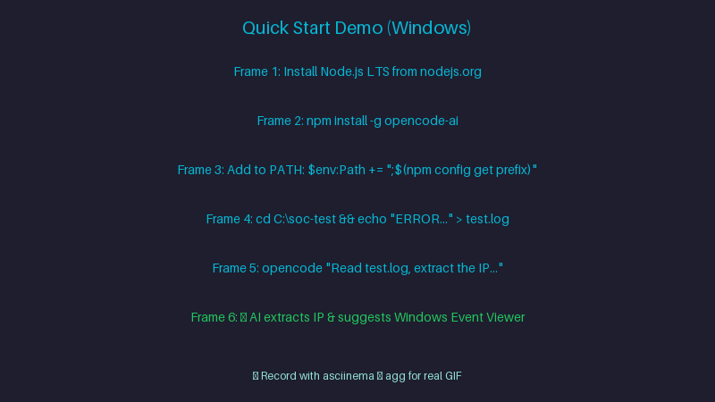
</p>

```powershell
# 1. Install Node.js LTS from https://nodejs.org (if not installed)
# Verify:
node -v
npm -v

# 2. Install OpenCode CLI
npm install -g opencode-ai

# 3. Get your NVIDIA API key → https://build.nvidia.com/explore/discover

# 4. Test in 30 seconds
mkdir C:\soc-test
cd C:\soc-test
echo "2024-01-15 10:30:45 ERROR Failed login from 192.168.1.100 user=admin" > test.log
opencode "Read test.log, extract the IP, and tell me what to check next"
```

**Expected:** OpenCode reads the log, extracts `192.168.1.100`, and suggests checking Windows Event Viewer, firewall logs, SIEM alerts, and account lockout policies.

---

## 📖 About This Project

<p align="center">
  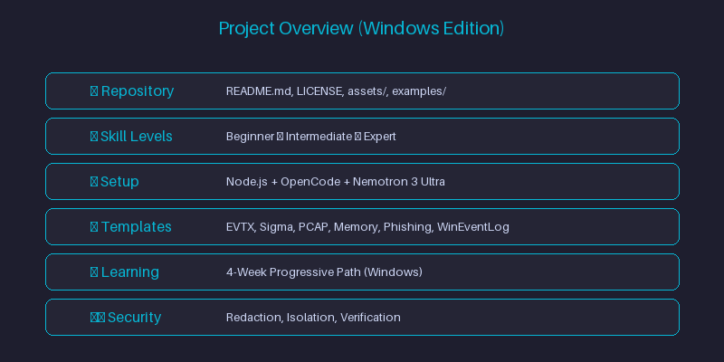
</p>

**SOC-Nemotron-CLI-Windows** is the **Windows edition** of the SOC-Nemotron-CLI project — a hands-on operational guide and prompt library for **Security Operations Center (SOC) Analysts, Threat Hunters, Detection Engineers, and Incident Responders** to leverage **NVIDIA Nemotron 3 Ultra (550B)** — a free, hosted, agentic-reasoning LLM — directly from a **Windows terminal** (PowerShell / Windows Terminal) via **OpenCode CLI**.

This repository adapts the original macOS-tested guide for **native Windows environments** — no local GPU required.

⚠️ **Status:** This Windows edition is **community-testing**. The base workflow (OpenCode + Nemotron 3 Ultra) was originally documented and verified on macOS. This edition adapts the same setup and prompt library for native Windows / PowerShell. Full end-to-end testing on native Windows is in progress — feedback welcome!

---

## 🚀 Why This Stack on Windows

<p align="center">
  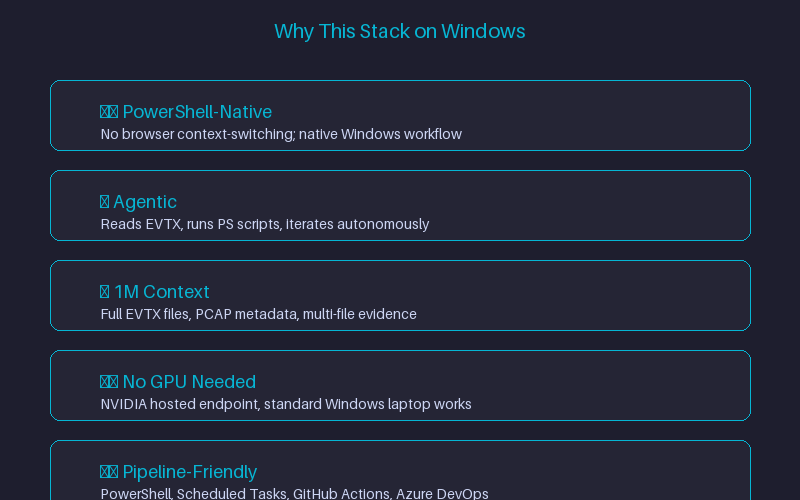
</p>

- **Terminal-native (PowerShell/Windows Terminal)** — stays inside the analyst's existing workflow (no browser context-switching mid-investigation)
- **Agentic, not just chat** — OpenCode reads files, runs scripts, iterates on errors, writes output artifacts autonomously (`--loop` mode)
- **1M-token context** — large enough to ingest full Windows Event Logs, EVTX files, PCAP metadata, or multi-file evidence sets
- **No local GPU required** — Nemotron 3 Ultra runs on NVIDIA's hosted endpoint; standard Windows laptop is enough
- **Scriptable & pipeline-friendly** — CLI-based, chains into PowerShell scripts, Scheduled Tasks, existing SOC automation

---

## 💻 Platform Support

| Platform | Status |
|----------|--------|
| 🪟 **Windows 10/11 (this repo)** | 🧪 **Community-testing** — feedback welcome |
| 🍎 macOS (original repo) | ✅ Tested & Documented |
| 🐧 Linux / WSL2 | 🔜 Companion repo (separate repo) |

> **Note:** The underlying CLI and API behavior is identical across platforms. Platform differences are cosmetic (PATH handling, shell syntax). If you test on Windows and hit issues, please report them!

📖 **See also:** [Original macOS Repo](https://github.com/amitambekar510/SOC-Nemotron-CLI) | [Platform Support Details](PLATFORM_SUPPORT.md) (coming soon)

---

## 📁 Repository Structure

```
SOC-Nemotron-CLI-Windows/
├── README.md              → This guide: Windows setup, config, prompts, notes
├── LICENSE                → MIT License
├── assets/                → Screenshots, diagrams for documentation
│   ├── hero-banner.png
│   ├── architecture-overview.png
│   ├── quickstart-demo.png
│   ├── project-overview.png
│   ├── why-this-stack.png
│   ├── opencode-tui.png
│   ├── sigma-output.png
│   ├── memory-forensics.png
│   ├── verify-install.png
│   ├── common-mistakes.png
│   ├── learning-path.png
│   ├── when-not-to-use.png
│   ├── nvidia-api-key.png
│   ├── opencode-install.png
│   ├── opencode-tui.png
│   ├── verify-install.png
│   └── quickstart-demo.png
├── examples/              → Ready-to-run configs and prompt files
│   ├── opencode.config.json
│   └── prompts/
│       ├── ioc-extraction.md
│       ├── sigma-rule.md
│       ├── memory-forensics.md
│       ├── pcap-analysis.md
│       ├── phishing-analysis.md
│       └── windows-eventlog.md
└── scripts/               → Reference PowerShell/Python scripts (coming soon)
    ├── parse_winevtx.ps1
    ├── generate_sigma.ps1
    └── volatility_wrapper.py
```

---

## 🎯 Skill-Level Operational Mapping

<p align="center">
  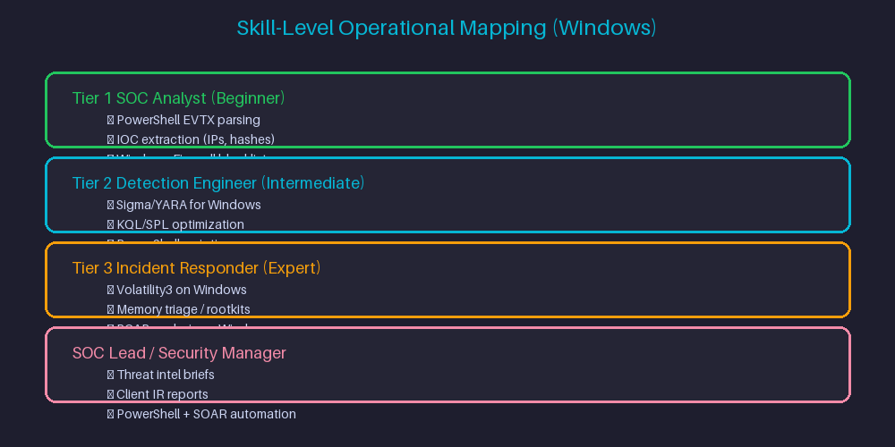
</p>

| Cybersecurity Role / Level | Primary Terminal Capabilities | Target Use Cases |
|----------------------------|------------------------------|------------------|
| **Tier 1 SOC Analyst (Beginner)** | PowerShell parsing, EVTX normalization, IOC extraction | Parse Windows Event Logs, defang IPs/URLs, create Windows Firewall blocklists |
| **Tier 2 Detection Engineer (Intermediate)** | PowerShell scripting, KQL/SPL query building, Sigma rule writing | Write & test Sigma/YARA rules, optimize KQL/SPL queries for Sentinel/Splunk |
| **Tier 3 Incident Responder (Expert)** | PowerShell automation, Volatility3 on Windows, memory forensics | Run iterative volatility loops, triage memory dumps, parse PCAPs on Windows |
| **SOC Lead / Security Manager** | Workflow automation, documentation generation | Generate threat intel briefs, automate IR reports, PowerShell + SOAR integration |

---

## ⚡ Setup & Authentication (Windows)

### 0. Get Your NVIDIA API Key

<p align="center">
  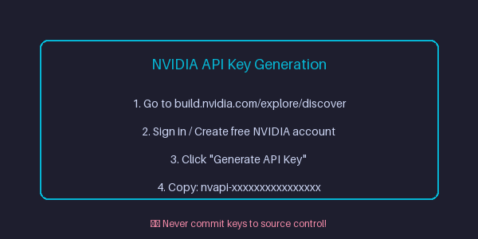
</p>

1. Open the [NVIDIA Nemotron 3 Ultra model page](https://build.nvidia.com/explore/discover) and sign in / create a free NVIDIA account
2. Click **Generate API Key**
3. Copy the key — it looks like `nvapi-xxxxxxxxxxxxxxxx`

⚠️ **Never share your API key publicly or commit it to source control.**

### 1. Install Prerequisites

OpenCode CLI requires **Node.js LTS**. If you don't have it:

1. Download and install **Node.js LTS for Windows** from [nodejs.org](https://nodejs.org)
2. Verify in PowerShell:
```powershell
node -v
npm -v
```

### 2. Install OpenCode CLI

Open **PowerShell** (or **Windows Terminal**) and run:
```powershell
npm install -g opencode-ai
```
> **Note:** The Unix-style `curl | bash` installer used on macOS/Linux does not apply directly to PowerShell. If you prefer that installer, use **WSL2** and follow the Linux edition instead.

See the official [OpenCode documentation](https://opencode.ai) for details.

### 3. Confirm OpenCode Is on PATH

`npm install -g` normally adds OpenCode to your PATH automatically. If PowerShell doesn't recognize the command:

```powershell
# Find where npm installs global packages
npm config get prefix

# Add that path to your User PATH via:
# System Properties > Environment Variables > User Variables > Path > Edit > New
# Or temporarily for current session:
$env:Path += ";$(npm config get prefix)"
```

Restart PowerShell after updating environment variables permanently.

### 4. Launch OpenCode and Connect to NVIDIA NIM

<p align="center">
  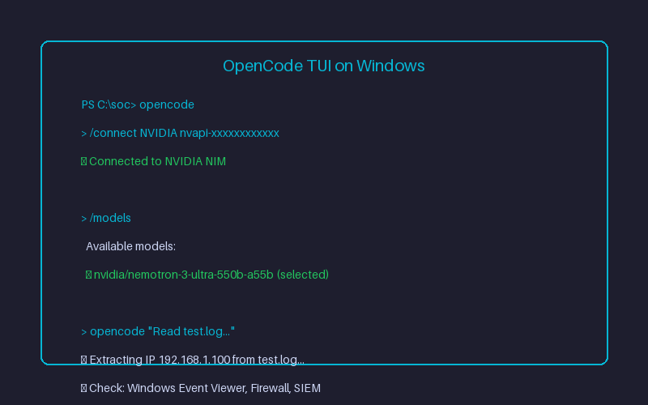
</p>

```powershell
# Navigate to your investigation / log directory
cd C:\soc-investigations

# Launch OpenCode TUI
opencode

# Authenticate and select Nemotron 3 Ultra
/connect NVIDIA nvapi-YOUR_NVIDIA_API_KEY
/models  # Select: nvidia/nemotron-3-ultra-550b-a55b
```

### 5. Provider Configuration

Add to your OpenCode config file (typically `%USERPROFILE%\.config\opencode\opencode.json` — confirm exact path via `opencode --help`):

```json
{
  "$schema": "https://opencode.ai/config.json",
  "provider": {
    "nvidia": {
      "npm": "@ai-sdk/openai-compatible",
      "name": "NVIDIA NIM",
      "options": {
        "baseURL": "https://integrate.api.nvidia.com/v1",
        "apiKey": "nvapi-YOUR_NVIDIA_API_KEY"
      },
      "models": {
        "nvidia/nemotron-3-ultra-550b-a55b": {
          "name": "Nemotron 3 Ultra (550B)",
          "limit": {
            "context": 1000000,
            "output": 16384
          }
        }
      }
    }
  }
}
```

Replace `nvapi-YOUR_NVIDIA_API_KEY` with your actual NVIDIA NIM API key. **Never commit real keys to source control** — use environment variables or a secrets manager instead.

### Model Specs at a Glance

| Attribute | Detail |
|-----------|--------|
| **Model ID** | `nvidia/nemotron-3-ultra-550b-a55b` |
| **API Endpoint** | `https://integrate.api.nvidia.com/v1` |
| **Context Window** | Up to 1,000,000 tokens |
| **Total Parameters** | ~550B (NVIDIA lists 561B in endpoint specs) |
| **Active Parameters** | ~55B (MoE-style architecture) |
| **Use Cases** | Agentic reasoning, coding, planning, tool calling, long-context tasks |

---

## ✅ Verify Your Installation

<p align="center">
  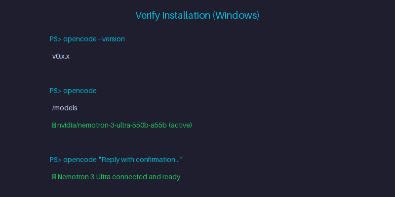
</p>

```powershell
# Confirm OpenCode is installed and on PATH
opencode --version

# Confirm the NVIDIA provider is connected and the model is selected
opencode
/models   # nvidia/nemotron-3-ultra-550b-a55b should show as active

# Run a quick smoke-test prompt
opencode "Reply with a one-line confirmation that Nemotron 3 Ultra is connected and ready."
```

If the model responds, your setup is complete and you're ready to move on to the SOC use cases below.

---

## 📋 Prompt Templates (Copy → Edit → Run)

Copy a template, replace the `{{PLACEHOLDERS}}`, and run in PowerShell.

### Windows Event Log Analysis
```powershell
opencode "Read {{EVTX_FILE}}, extract all Event IDs {{EVENT_IDS}}, extract source IPs, user accounts, and timestamps. Defang IPs and output to {{OUTPUT_FILE}}.json with fields: event_id, timestamp, source_ip, user, message."
```

### IOC Extraction & Firewall Blocklist (Windows Firewall)
```powershell
opencode "Read {{LOG_FILE}}, extract all {{IOC_TYPE}} (IPv4, domains, SHA256, emails), defang them, and structure into {{OUTPUT_FILE}}.json with fields: type, value, source, confidence, tags. Generate Windows Firewall PowerShell commands to block malicious IPs."
```

### Sigma Detection Rule Authoring (PowerShell/Event Log Focus)
```powershell
opencode "Analyze {{EVTX_FILE}} and generate a valid Sigma detection rule targeting {{ATTACK_TECHNIQUE}} with MITRE ATT&CK mapping. Focus on Windows Event Log fields (EventID, Provider, Channel, etc.). Include detection logic, false positive considerations, and test cases."
```

### PowerShell Script Generator (Log Parsing)
```powershell
opencode "Write a PowerShell script to parse {{LOG_FORMAT}} logs (EVTX, text, CSV), extract {{FIELD_LIST}}, and output CSV. Handle {{EDGE_CASES}}. Save as Parse-{{LOG_TYPE}}.ps1 with proper error handling and pipeline support."
```

### PCAP Metadata Extraction (Windows Tools)
```powershell
opencode "Read {{PCAP_FILE}}, extract conversation summary, top talkers, DNS queries, HTTP hosts/URLs, TLS SNI, and suspicious patterns. Use Windows-compatible tools (tshark, PowerShell). Output summary as {{OUTPUT_FILE}}.md"
```

### Memory Forensics Triage (Volatility3 on Windows)
```powershell
opencode --loop "Write a Python script using Volatility3 to parse {{MEMORY_DUMP}} for {{ARTIFACT_TYPE}} (processes, network connections, injected code, registry hives). Handle Windows-specific issues (symbol tables, profile detection). Output markdown triage report."
```

### Phishing Email Header Analysis
```powershell
opencode "Read {{EML_FILE}}, parse all headers, extract sender IP path, SPF/DKIM/DMARC results, authentication results, message IDs, hop delays, and identify anomalies. Output as {{OUTPUT_FILE}}.json with fields: headers_parsed, spf_result, dkim_result, dmarc_result, ip_path, anomalies, risk_score."
```

### Windows Event Log Threat Hunting
```powershell
opencode "Read {{EVTX_DIR}}, hunt for {{MITRE_TECHNIQUE}} (e.g., T1059.001, T1003, T1003.001). Correlate Event IDs 4688, 4624, 4625, 4672, 5140, 5145, 4656-4663. Output findings with MITRE mapping and timeline."
```

---

## ❌ Common Mistakes & Fixes (Windows)

<p align="center">
  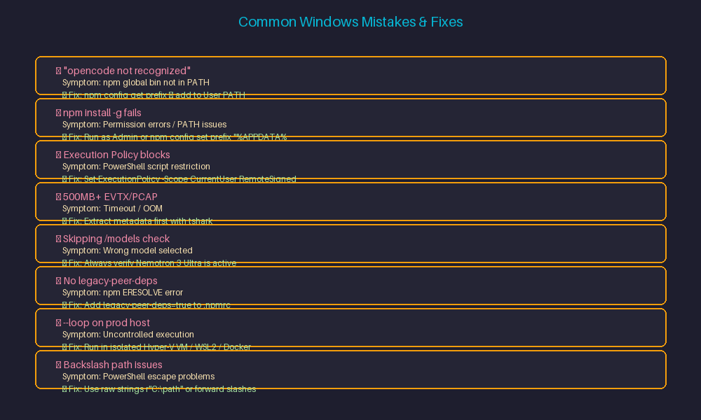
</p>

| Mistake | Symptom | Fix |
|---------|---------|-----|
| `'opencode' is not recognized` | npm global bin folder not in PATH | Run `npm config get prefix`, add that folder to User PATH via Environment Variables, restart PowerShell |
| `npm install -g` fails with permission errors | PowerShell not Admin, or npm prefix protected | Run PowerShell as Admin, or `npm config set prefix "%APPDATA%\npm"` |
| Execution Policy blocks scripts | PowerShell script execution restricted | Run `Set-ExecutionPolicy -Scope CurrentUser RemoteSigned` (review implications) |
| `opencode` runs but no output | Not in evidence directory | `cd` into directory with logs/EVTX files before starting `opencode` |
| Passing 500MB+ EVTX/PCAP directly | Timeout / OOM / truncated context | Extract metadata first: `tshark -r file.pcap -T json > meta.json` |
| Skipping `/models` check | Wrong model selected | Always run `/models` and verify `nvidia/nemotron-3-ultra-550b-a55b` is active |
| `npm install -g` fails with ERESOLVE | React 19 peer dependency conflict | Add `legacy-peer-deps=true` to `.npmrc` |
| `--loop` on production host | Uncontrolled script execution | Run loops in isolated VM/container only |
| Passing sensitive logs without redaction | Credentials/API keys sent to AI | Scrub secrets (API keys, passwords, tokens) from logs before prompting |
| Path issues with backslashes | PowerShell escape issues | Use raw strings `r'C:\path'` or forward slashes `C:/path` |

---

## 🎓 Learning Path (Week-by-Week)

<p align="center">
  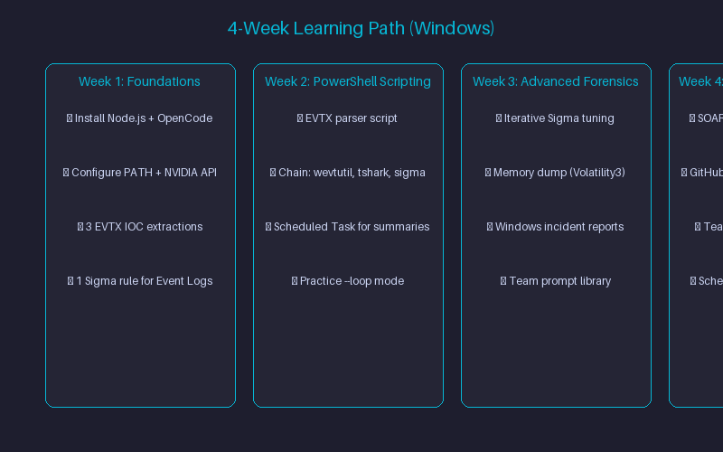
</p>

### **Week 1: Foundations (Windows)**
- [ ] Install Node.js LTS, verify `node -v` / `npm -v`
- [ ] Install OpenCode CLI via `npm install -g opencode-ai`
- [ ] Configure PATH if needed (`npm config get prefix` → Environment Variables)
- [ ] Get NVIDIA API key, connect (`/connect NVIDIA nvapi-...`)
- [ ] Verify `/models` shows Nemotron 3 Ultra
- [ ] Run 3 IOC extraction prompts on sample Windows logs
- [ ] Generate 1 Sigma rule for Windows Event Logs, test in local SIEM

### **Week 2: Scripting & Automation (PowerShell)**
- [ ] Write a PowerShell log parser script via prompt template
- [ ] Chain opencode with Windows tools (`tshark`, `wevtutil`, `Get-WinEvent`, `Sigma`)
- [ ] Build a Scheduled Task for daily log summary email
- [ ] Practice `--loop` mode on a safe test case

### **Week 3: Advanced Workflows (Windows Forensics)**
- [ ] Use `--loop` for iterative Sigma rule tuning (generate → test → refine)
- [ ] Parse memory dump with Volatility3 via opencode `--loop` on Windows
- [ ] Generate client-ready incident report from raw Windows evidence
- [ ] Build a reusable prompt library for your team

### **Week 4: Integration & Operationalization (Windows Ecosystem)**
- [ ] Wrap a workflow in SOAR playbook (Cortex XSOAR, Splunk SOAR, Tines, PowerShell)
- [ ] Add to CI/CD for detection rule validation (GitHub Actions, Azure DevOps)
- [ ] Document team runbook with approved Windows-specific prompts
- [ ] Set up Scheduled Tasks for daily/weekly triage jobs

---

## 🧰 Example Prompts by Use Case (Windows-Focused)

### Windows Event Log IOC Extraction
```powershell
opencode "Read Security.evtx, extract all Event ID 4624 (Logon) and 4625 (Failed Logon) events. Extract source IPs, usernames, logon types, and timestamps. Defang IPs. Output to logon_analysis.json with fields: event_id, timestamp, ip, user, logon_type, status."
```

### Sigma Rule for PowerShell Obfuscation
```powershell
opencode "Analyze powershell_obfuscation.evtx and generate a Sigma rule targeting obfuscated PowerShell (T1059.001). Focus on Event ID 4104 (PowerShell Script Block Logging). Include detection for -enc, -EncodedCommand, IEX, FromBase64String, Invoke-Expression. Map to MITRE ATT&CK T1059.001, T1027."
```

### Autonomous Memory Forensics Triage (Loop Mode)
```powershell
opencode --loop "Write a Python script using Volatility3 to parse memory.dmp for processes, network connections, injected code, and registry hives. Handle Windows symbol table issues. Output markdown triage report with: executive summary, process tree, suspicious processes, network connections, injected code, persistence mechanisms, IOCs."
```

---

## 🖥️ Sample Output (Illustrative)

<p align="center">
  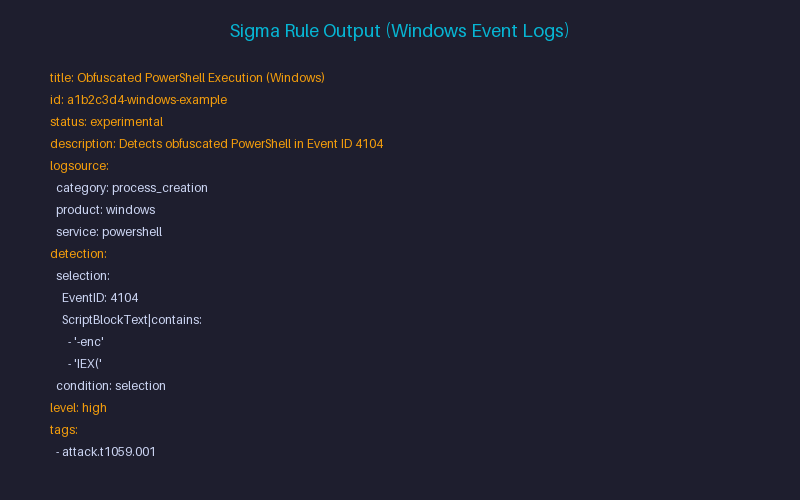
</p>

```yaml
title: Obfuscated PowerShell Execution Detected (Windows Event Logs)
id: a1b2c3d4-windows-example
status: experimental
description: Detects encoded/obfuscated PowerShell command-line patterns in Windows Event Logs (Event ID 4104).
logsource:
  category: process_creation
  product: windows
  service: powershell
detection:
  selection:
    EventID: 4104
    ScriptBlockText|contains:
      - '-enc'
      - '-EncodedCommand'
      - 'IEX('
      - 'Invoke-Expression'
      - 'FromBase64String'
  condition: selection
level: high
tags:
  - attack.execution
  - attack.t1059.001
  - attack.t1027
```

⚠️ **Illustrative example only** — always review generated rules before deployment.

---

## 💰 Rate Limits & Cost Notes

- NVIDIA's hosted endpoint for Nemotron 3 Ultra is currently free tier — exact quotas set by NVIDIA, subject to change
- Check current limits on your [NVIDIA build.nvidia.com](https://build.nvidia.com) dashboard
- For high-volume/production SOC use, plan for paid tier or self-hosted inference

---

## 🧩 Troubleshooting (Windows)

| Issue | Technical Cause | Operational Fix |
|-------|-----------------|-----------------|
| `'opencode' is not recognized...` | npm global bin folder not in PATH | Run `npm config get prefix`, add to User PATH via Environment Variables, restart PowerShell |
| `npm install -g` fails with permission errors | PowerShell not Admin, or npm prefix protected | Run PowerShell as Admin, or `npm config set prefix "%APPDATA%\npm"` |
| Execution Policy blocks scripts | PowerShell script execution restricted | Run `Set-ExecutionPolicy -Scope CurrentUser RemoteSigned` (review implications) |
| Execution Timeout on PCAPs | Local security tools missing/not on PATH | Install tshark, yara, volatility3 for Windows; ensure in system PATH |
| `'opencode' runs but no output` | Not in evidence directory | `cd` into directory with logs/EVTX files before starting `opencode` |
| `npm install -g` fails with ERESOLVE | React 19 peer dependency conflict | Add `legacy-peer-deps=true` to `.npmrc` |
| Path issues with backslashes | PowerShell escape issues | Use raw strings `r'C:\path'` or forward slashes `C:/path` |

---

## 🚫 When NOT to Use This Stack

<p align="center">
  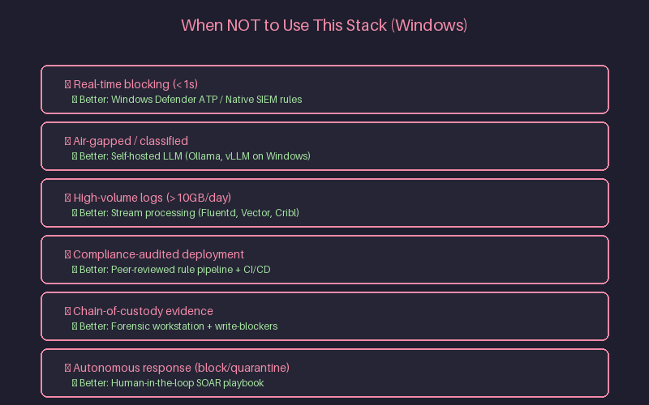
</p>

| Scenario | Better Alternative |
|----------|-------------------|
| Real-time blocking (sub-second latency) | Native Windows Defender ATP / SIEM/SOAR rules |
| Air-gapped / classified environments | Self-hosted LLM (Ollama, vLLM, llama.cpp on Windows) |
| High-volume log processing (>10 GB/day) | Stream processing (Fluentd, Vector, Cribl) |
| Compliance-audited rule deployment | Peer-reviewed rule pipeline with CI/CD validation |
| Evidence requiring chain-of-custody | Forensic workstation with write-blockers |
| Autonomous response (block, quarantine) | Human-in-the-loop SOAR playbook |

---

## ⚡ Setup & Authentication (Windows) — Quick Reference

### 0. Get NVIDIA API Key
1. Open [NVIDIA Nemotron 3 Ultra](https://build.nvidia.com/explore/discover) → sign in → **Generate API Key**
2. Copy key (`nvapi-xxxxxxxxxxxxxxxx`)

### 1. Install Node.js + OpenCode
```powershell
# Install Node.js LTS from nodejs.org first
npm install -g opencode-ai
# Add to PATH if needed: $env:Path += ";$(npm config get prefix)"
```

### 2. Connect & Configure
```powershell
cd C:\soc-investigations
opencode
/connect NVIDIA nvapi-YOUR_KEY
/models  # Select: nvidia/nemotron-3-ultra-550b-a55b
```

### 3. Provider Config
Create `%USERPROFILE%\.config\opencode\opencode.json`:
```json
{
  "$schema": "https://opencode.ai/config.json",
  "provider": {
    "nvidia": {
      "npm": "@ai-sdk/openai-compatible",
      "name": "NVIDIA NIM",
      "options": {
        "baseURL": "https://integrate.api.nvidia.com/v1",
        "apiKey": "nvapi-YOUR_NVIDIA_API_KEY"
      },
      "models": {
        "nvidia/nemotron-3-ultra-550b-a55b": {
          "name": "Nemotron 3 Ultra (550B)",
          "limit": { "context": 1000000, "output": 16384 }
        }
      }
    }
  }
}
```

---

## ✅ Verify Your Installation

<p align="center">
  
</p>

```powershell
opencode --version
opencode
/models   # Verify: nvidia/nemotron-3-ultra-550b-a55b
opencode "Reply with a one-line confirmation that Nemotron 3 Ultra is connected and ready."
```

---

## 🗑️ Uninstall / Disconnect

```powershell
# Remove OpenCode CLI
npm uninstall -g opencode-ai
# Remove PATH entry via Environment Variables if added manually

# Revoke NVIDIA API key
# → build.nvidia.com → API Keys → Delete
```

---

## ⚠️ Security & Operational Guidelines

- **Redact Sensitive Data** — Scrub production credentials, API secrets, PII from logs before AI prompts
- **Isolate Environments** — Run `--loop` in isolated VMs/containers (Hyper-V, WSL2, Docker Desktop)
- **Analyst Verification** — Manually inspect generated firewall rules and KQL/SPL queries before production
- **No Autonomous Response** — Never let AI directly block, quarantine, or modify production systems
- **Windows-Specific** — Use Windows Defender ATP / Microsoft Sentinel native APIs for response actions

---

## 🔗 Official Reference Links

- [NVIDIA Nemotron 3 Ultra — Model Page](https://build.nvidia.com/explore/discover)
- [NVIDIA Nemotron 3 Ultra — Model Card](https://huggingface.co/nvidia/nemotron-3-ultra)
- [OpenCode Documentation](https://opencode.ai)
- [OpenCode NVIDIA Provider Guide](https://opencode.ai/docs/providers/nvidia)
- [Node.js for Windows](https://nodejs.org/en/download/)
- [PowerShell Documentation](https://learn.microsoft.com/powershell/)
- [Windows Event Log Documentation](https://learn.microsoft.com/windows/win32/wes/windows-event-log)

---

## 🗺️ Roadmap

- [x] Windows setup guide, config, and prompt library (this repo — community-testing)
- [ ] Linux/WSL2 setup guide (companion repo)
- [ ] Additional Windows-specific SOC/IR prompt examples
- [ ] `examples/` folder with ready-to-run configs and prompt files
- [ ] Reference PowerShell scripts (EVTX parsers, Sigma generators, Volatility wrappers)
- [ ] Windows-specific troubleshooting guide (Execution Policy, PATH, tools)

---

## 🤝 Contributing

This is a personal study/reference repo, and the **Windows edition is community-testing**. If you run this on a real Windows machine and find something that needs correcting, please open an issue/PR — or reach out directly (see Author).

### 📝 Submit a Prompt Template

```markdown
**Use Case:** [e.g., Windows Event Log lateral movement detection]
**Skill Level:** [Beginner / Intermediate / Expert]
**Prompt:**
```
opencode "Your prompt here with {{PLACEHOLDERS}}"
```

**Sample Input:** [paste or describe]
**Expected Output:** [describe]
**Tools Required:** [local binaries, APIs]
**Validation Steps:** [how to verify output]
```

**PR Title:** `prompt: add [use-case] template`

---

## 📝 Source & Learning Notes

This repo adapts the original macOS-tested SOC-Nemotron-CLI guide for native Windows environments, as part of ongoing self-study into emerging AI capabilities relevant to security operations. It combines setup steps, configuration, and cybersecurity-specific example prompts adapted for PowerShell/Windows Terminal — currently scoped to Windows community-testing, with Linux/WSL2 guides planned.

⚠️ **Disclaimer:** NVIDIA's hosted endpoint is currently offered for free, but availability, quotas, and trial terms are subject to change and governed by NVIDIA's API Trial Terms and the model's license. This guide is for educational and informational purposes only — no outcome is guaranteed. NVIDIA, Nemotron, OpenCode, and other product names are trademarks of their respective owners.

---

## 👤 Author

**Amit Ambekar**  
🔗 GitHub — [@amitambekar510](https://github.com/amitambekar510)  
🔗 LinkedIn — [Amit Milind Ambekar](https://linkedin.com/in/amitmilindambekar/)  
Exploring emerging AI tooling for cybersecurity operations. Spotted something that needs fixing on your Windows setup, or have a better approach? Connect on LinkedIn and let's discuss.

---

## 📜 License

MIT License — see [LICENSE](LICENSE) for details.

---

## 📸 Assets Needed

> **Note:** Add these images to the `assets/` folder for the README to render properly.

```
assets/
├── hero-banner.png
├── architecture-overview.png
├── quickstart-demo.png
├── project-overview.png
├── why-this-stack.png
├── opencode-tui.png
├── sigma-output.png
├── memory-forensics.png
├── verify-install.png
├── common-mistakes.png
├── learning-path.png
├── when-not-to-use.png
├── nvidia-api-key.png
├── opencode-install.png
├── opencode-tui.png
└── verify-install.png
```

---

## 🙏 Acknowledgments

- [NVIDIA](https://www.nvidia.com/) for Nemotron 3 Ultra
- [OpenCode](https://opencode.ai/) for the agentic CLI
- Security community for inspiration and feedback
- Windows security community for PowerShell/Event Log expertise